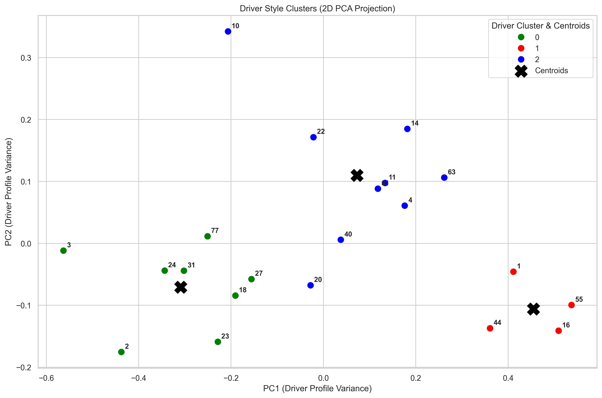
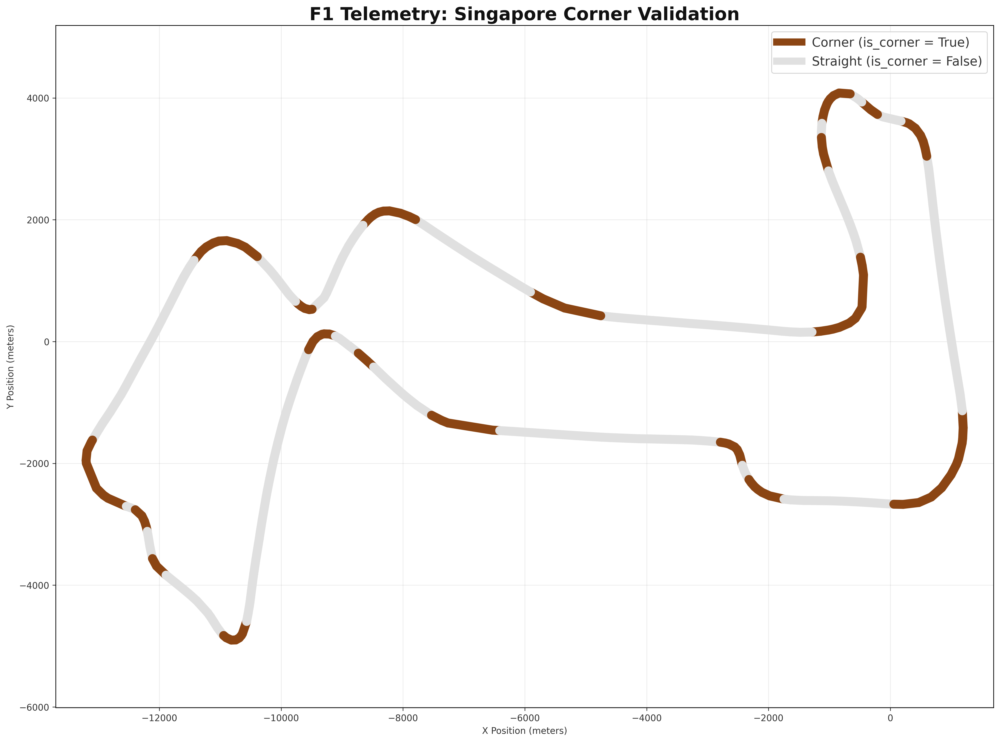
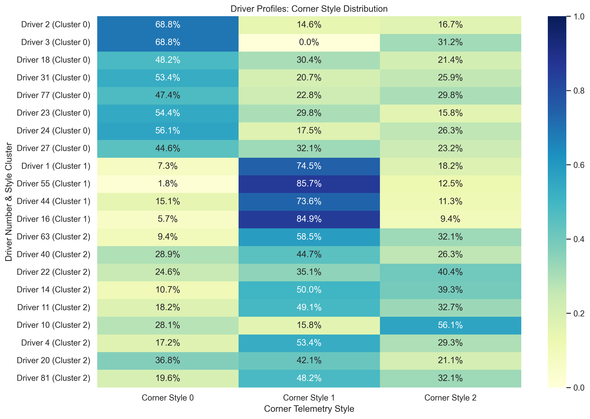

# Formula 1 Driving-Style Clustering

Characterising driver "archetypes" from Formula 1 qualifying telemetry using unsupervised learning.

Academic project, Data Engineering & AI, Faculty of Engineering, Bar-Ilan University (2026).
Team: Ido Brener, Roee Amsalem, Oren Yehezkel.



*Each point is a driver, positioned by their cornering profile. The three colours are the style clusters; the crosses are centroids.*

---

## The question

Rather than predicting who wins, we asked whether distinct **driving styles** emerge from raw car telemetry alone — for example, drivers who brake late and hard versus drivers who carry speed smoothly through a corner.

The unit of analysis is a single corner, not a lap: two drivers can post the same lap time through completely different corner behaviour.

## Data

Pulled from the public [OpenF1 API](https://openf1.org/): car telemetry, GPS location and lap records for four 2023 qualifying sessions chosen for contrasting track character — **Monza, Spa, Singapore and Suzuka**.

Three raw streams per session: `car_data` (speed, throttle, brake, gear, RPM, DRS), `location` (x/y), and `laps`.

## Pipeline

**1. Ingestion — `data_extraction_and_processing/new_data_extraction.py`**
Fetches each driver's streams per session. Handles HTTP 429 rate limiting with backoff, retries on timeouts, discovers the drivers who actually participated in each session, and skips files already on disk so a failed run can resume.

**2. Processing — `new_data_processing.py`**
Drops pit-out laps and laps without a valid duration, selects each driver's fastest lap, then time-aligns the high-frequency telemetry with the GPS trace using `pandas.merge_asof` (nearest match) to produce one clean, position-aware lap per driver.

**3. Corner segmentation and feature engineering — `corner_analytics_visualise2.py`**
Detects corners and assigns each continuous corner block an id, then derives per-corner behavioural features: entry / apex / exit speed, speed drop, braking percentage, trail-braking percentage, coasting percentage, throttle application after apex, minimum gear and average throttle.



*Corner detection checked against the real track layout — Singapore, with detected corners in brown and straights in grey.*

**4. Scaling — `data_scaling.py`**
Standardises features with a **group-wise z-score per (track, corner)** rather than globally, so a driver is compared only against the other drivers in that same corner. A small epsilon is added to the standard deviation to avoid division by zero when every driver behaves identically.

**5. Clustering — `roee_notebook/05_Clustering_With_PCA.ipynb`, `06_Clustering_Without_PCA.ipynb`**
PCA retaining 95% of the variance reduces 12 correlated telemetry features to 9 principal components. Clustering then runs in two stages: K-Means (k=3) over the corner-level components produces three base **cornering styles**, and a second K-Means (k=3) over each driver's resulting profile groups the **drivers** themselves.

DBSCAN was evaluated first and rejected: Formula 1 telemetry is continuous rather than forming isolated dense pockets, so DBSCAN either labelled most corners as noise or merged everything into one blob.

`k` was chosen deliberately rather than mechanically — the silhouette score favoured k=2 and the elbow method suggested k=4, so k=3 was taken as the compromise that also matches how driving styles are described in practice. Both runs, with and without PCA, are kept side by side: without PCA the clusters overlap heavily, with PCA they separate cleanly.

## Results

Three distinct driving styles emerged from the telemetry alone:

- **Aggressive** — higher entry and exit speeds, large speed drops, late and harsh braking, heavy throttle early on corner exit.
- **Careful / conservative** — lower entry speeds, earlier and longer braking, gradual throttle application, smaller speed drops and smoother momentum.
- **Balanced** — adapts between the two depending on track and corner.



*How each driver's corners distribute across the three cornering styles — the profile that the second clustering stage groups on.*

Two findings stood out:

**Style belongs to the driver, not the car.** Teammates driving identical machinery landed in different style clusters, which argues against the "the car decides the result" explanation.

**Aggression correlated with finishing position.** The further right a driver sat on the PCA projection — the more aggressive the profile — the better their average race standing tended to be. This is a correlation observed across four sessions, not a causal claim.

## Known limitations

Telemetry drops for a few seconds at the start and end of each lap. Because corner detection relies on positional change, those gaps can register as false corners and add noise. Extreme outliers also pull K-Means centroids toward them, which is part of why the per-corner standardisation and the outlier review in `04_Outliers_Analysis` matter.

Four qualifying sessions from a single season is a narrow sample; the conclusions describe this dataset, not Formula 1 in general.

## Repository layout

```
data_extraction_and_processing/   ingestion, processing, corner features, scaling
roee_notebook/                    EDA, outlier analysis and clustering notebooks
visuals/                          plotting scripts and track-rendering utilities
figures/                          key figures referenced from this README
data/                             raw and processed CSVs for the four sessions
docs/                             written report and submission notebooks
archive/                          earlier iterations of the pipeline
```

## Notebooks

| Notebook | Contents |
|---|---|
| `01_Driver_Demographics_EDA` | Driver-level exploratory analysis |
| `02_Track_Characteristics_EDA` | Track-level comparison |
| `03_Track_Telemetry_Mapping` | Telemetry mapped onto track geometry |
| `04_Outliers_Analysis` | Lap-time and telemetry outlier review |
| `05_Clustering_With_PCA` | PCA + K-Means, elbow and silhouette |
| `06_Clustering_Without_PCA` | Same clustering on the unreduced feature set |

## Running it

```bash
pip install pandas numpy scikit-learn matplotlib seaborn requests

python data_extraction_and_processing/new_data_extraction.py   # downloads raw sessions
python data_extraction_and_processing/new_data_processing.py   # fastest laps + alignment
python data_extraction_and_processing/data_scaling.py          # per-corner standardisation
# then run the notebooks in roee_notebook/ in order
```

Ingestion takes a while and is deliberately resumable — re-running skips sessions already downloaded.

## Built with

Python · pandas · NumPy · scikit-learn · Matplotlib · Seaborn · Jupyter · OpenF1 REST API
